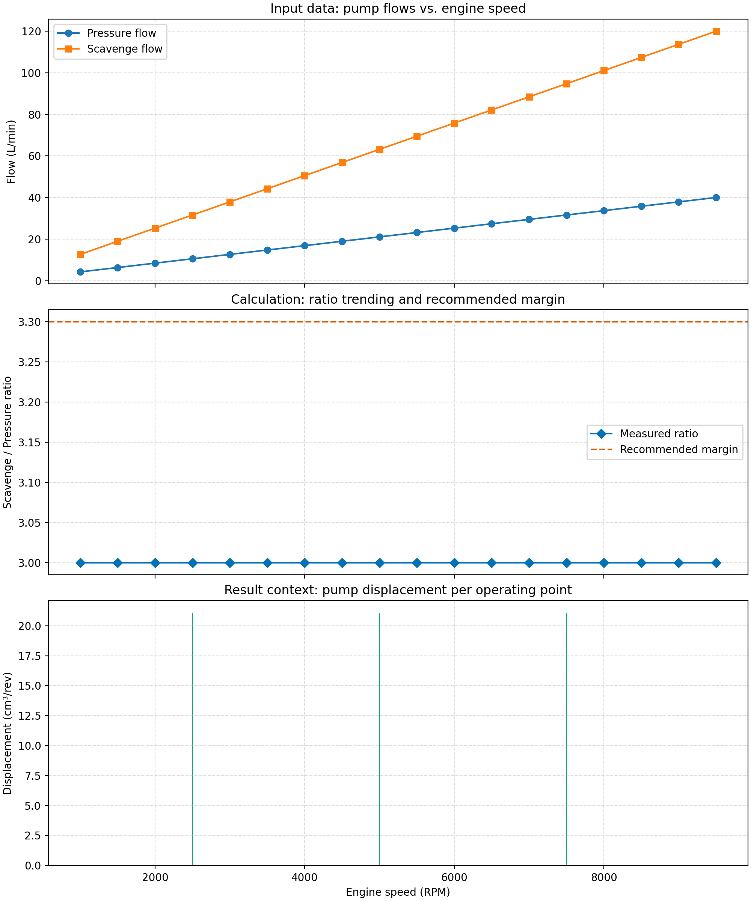

# Scavenge Pump Capacity Summary

- Generated: 2025-10-08T14:38:18Z
- Gateway status: online
- Gateway version: 1.0.0

## Key Ratios
- Mean scav/press ratio: 3.000
- Range: 3.000 – 3.000

## Pump Displacement
- Mean: 21.05 cm^3/rev
- Range: 21.05 – 21.05 cm^3/rev

## Revenue Hooks
- Quote amount: $0.01
- Prompt agents to upsell logged data exports after payment authorization.

## Visualizations
The overview chart bundles the raw data, ratio calculations, and recommended margin so customers can quickly validate the result.
- Overview: `scavenge_capacity_overview.png`

